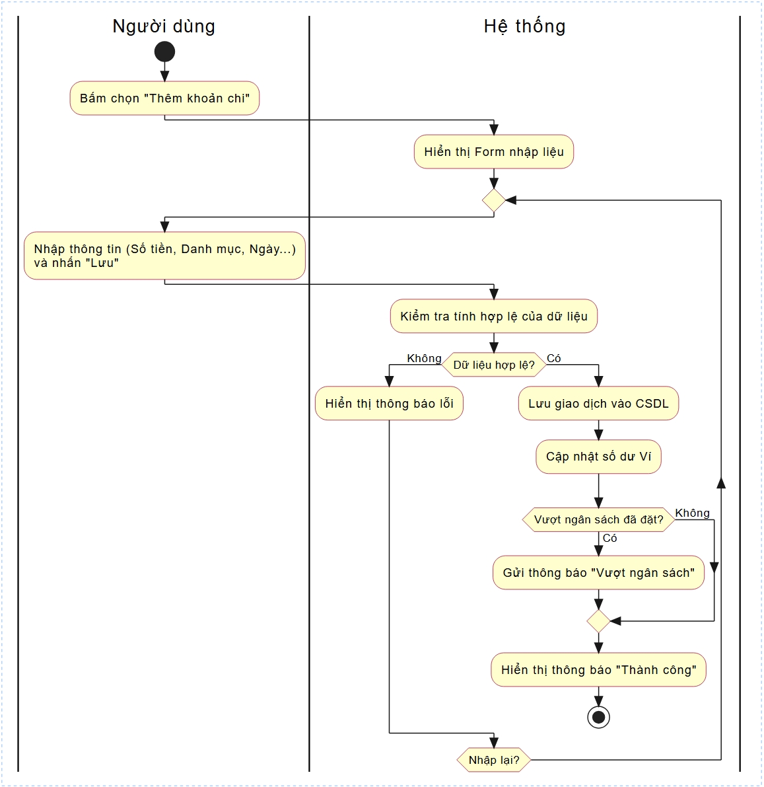

# Ứng dụng quản lý chi tiêu cá nhân 
> **Dự án cuối kỳ môn Lập Trình Web**  
> Nhóm TnT – K18 – Năm học 2026  
> Giảng viên hướng dẫn: TS. Nguyễn Lệ Thu


Dự án **Ứng dụng quản lý chi tiêu cá nhân** được phát triển bằng ngôn ngữ Typescript với framework NestJS, là bài tập lớn cho môn học Lập trình Web. Ứng dụng cung cấp các chức năng cơ bản để quản lý chi tiêu cá nhân.

--- 
## 🎯 Giới thiệu

Mục tiêu của dự án là xây dựng một ứng dụng phần mềm hoàn chỉnh, áp dụng các nguyên tắc của lập trình

Hệ thống được thiết kế để giải quyết các bài toán cơ bản trong việc quản lý chi tiêu cá nhân, bao gồm quản lý thu nhập, chi tiêu, và theo dõi chi tiêu. Với giao diện web đơn giản và thân thiện, ứng dụng phù hợp cho mục đích học tập và có thể dễ dàng mở rộng, phát triển thêm các tính năng nâng cao trong tương lai.

--- 
## 📖 Mục lục

- [🚀 Ứng dụng quản lý chi tiêu cá nhân](#-ứng-dụng-quản-lý-chi-tiêu-cá-nhân)
  - [🎯 Giới thiệu](#-giới-thiệu)
  - [📖 Mục lục](#-mục-lục)
  - [👥 Thành viên nhóm](#-thành-viên-nhóm)
  - [🏗️ Phân tích và Thiết kế](#️-phân-tích-và-thiết-kế)
  - [📂 Cấu trúc Thư mục](#-cấu-trúc-thư-mục)
  - [✨ Tính năng chính](#-tính-năng-chính)
  - [📊 Biểu đồ lớp (Class Diagram)](#-biểu-đồ-lớp-class-diagram)
  - [🔁 Biểu đồ hoạt động (Activity Diagram)](#-biểu-đồ-hoạt-động-activity-diagram)
  - [🖼️ Giao diện chương trình (Console)](#️-giao-diện-chương-trình-console)
  - [💡 Công nghệ sử dụng](#-công-nghệ-sử-dụng)
  - [📚 Tài liệu tham khảo](#-tài-liệu-tham-khảo)


--- 

## 👥 Thành viên nhóm

| STT | Họ tên           | Mã sinh viên | GitHub                                             | Vai trò        |
|-----|------------------|-------------|----------------------------------------------------|----------------|
| 1   | Nguyễn Xuân Thắng| 24100529    | [nthagg03](https://github.com/nthagg03)           | Team Leader    |
| 2   | Đàm Thế Tân    | 24100270 | [TanDam06](https://github.com/TanDam06)           | Developer      |

--- 

## 🏗️ Phân tích và Thiết kế

Dưới đây là cấu trúc các đối tượng chính trong hệ thống:

<details>
<summary><strong>👤 Người dùng (User)</strong></summary>

**Thuộc tính:**

**Phương thức:**

</details>

<details>
<summary><strong>💸 Chi tiêu (Expense)</strong></summary>

**Thuộc tính:**
- `category`: Loại chi tiêu
- `description`: Mô tả chi tiêu
- `amount`: Số tiền chi tiêu
- `date`: Ngày chi tiêu

**Phương thức:**
- `addExpense()`: Thêm chi tiêu mới
- `updateExpense()`: Cập nhật thông tin chi tiêu
- `deleteExpense()`: Xóa chi tiêu
- `getExpense()`: Lấy danh sách chi tiêu
- `getExpenseById()`: Lấy chi tiêu theo ID
- `getExpenseByCategory()`: Lấy chi tiêu theo loại
- `getExpenseByDate()`: Lấy chi tiêu theo ngày

</details>

<details>
<summary><strong>📂 Category</strong></summary>

**Thuộc tính:**
- `id`: ID danh mục (Khóa chính)
- `name`: Tên danh mục

**Phương thức:**
- `createCategory()`: Tạo danh mục mới
- `updateCategory()`: Cập nhật thông tin danh mục
- `deleteCategory()`: Xóa danh mục
- `getCategory()`: Lấy danh sách danh mục
- `getCategoryById()`: Lấy danh mục theo ID

</details>

<details>
<summary><strong>Budget</strong></summary>

**Thuộc tính:**
- `budgetId`: ID ngân sách (Khóa chính)
- `budgetName`: Tên ngân sách
- `budgetAmount`: Số tiền ngân sách
- `budgetCategory`: Loại ngân sách
- `budgetRemaining`: Số tiền còn lại
- `budgetSpent`: Số tiền đã chi
- `budgetStatus`: Trạng thái (`PENDING`, `COMPLETED`, `FAILED`, `REFUNDED`)
- `budgeTransactionId`: Mã giao dịch

**Phương thức:**
- `addBudget()`: Thêm ngân sách mới
- `updateBudget()`: Cập nhật thông tin ngân sách
- `deleteBudget()`: Xóa ngân sách
- `getBudget()`: Lấy danh sách ngân sách
- `getBudgetById()`: Lấy ngân sách theo ID
- `getBudgetByCategory()`: Lấy ngân sách theo loại
- `getBudgetByDate()`: Lấy ngân sách theo ngày

</details>

<details>
<summary><strong>Income</strong></summary>

**Thuộc tính:**
- `incomeId`: ID thu nhập (Khóa chính)
- `incomeName`: Tên thu nhập
- `incomeAmount`: Số tiền thu nhập
- `incomeCategory`: Loại thu nhập
- `lastUpdated`: Ngày cập nhật cuối
- `supplierId`: ID nhà cung cấp
- `costPrice`: Giá vốn trung bình

**Phương thức:**
- `addIncome()`: Thêm thu nhập mới
- `updateIncome()`: Cập nhật thông tin thu nhập
- `deleteIncome()`: Xóa thu nhập
- `getIncome()`: Lấy danh sách thu nhập
- `getIncomeById()`: Lấy thu nhập theo ID
- `getIncomeByCategory()`: Lấy thu nhập theo loại
- `getIncomeByDate()`: Lấy thu nhập theo ngày

</details>

--- 

## 📂 Cấu trúc Thư mục

```plaintext
Quanlychitieu/
 ├─ backend/
 │   ├─ src/
 │   │   ├─ expense/
 │   │   ├─ income/
 │   │   ├─ budget/
 │   │   ├─ user/
 │   │   ├─ main.ts
 │   │   ├─ app.module.ts
 │   │   ├─ app.controller.ts
 │   │   ├─ app.service.ts
 │   │   ├─ ...
 │   ├─ test/                                                                   # Thư mục chứa các lớp kiểm thử thủ công
README.md                                                                       # Tài liệu mô tả dự án 
```

--- 
## ✨ Tính năng chính


--- 

## 📊 Biểu đồ lớp (Class Diagram)

--- 

## 🔁 Biểu đồ hoạt động (Activity Diagram)

### 1. Chi tiêu


### 2. 

### 3. 

### 4. 

### 5. 

--- 

## 🖼️ Giao diện chương trình (Console)

--- 

## 💡 Công nghệ sử dụng

- Ngôn ngữ lập trình: **Typescript**
- Framework: [NestJS](https://nestjs.com/)

--- 

## 📚 Tài liệu tham khảo

- Slide bài giảng môn Lập trình Web – GVHD: Nguyễn Lệ Thu
- Java Docs – Oracle
- Stack Overflow – Community

--- 

## Hướng dẫn cài đặt

1. Clone project
git clone <repository-url>

2. Cài đặt packages
npm install

3. Tạo file .env

DB_HOST=localhost
DB_PORT=3306
DB_USER=root
DB_PASSWORD=your_password
DB_NAME=quanlychitieu
PORT=3000

4. Chạy server
npm run start:dev

> © 2026 Nhóm TnT    
> *Ứng dụng quản lý chi tiêu – Mã nguồn mở cho mục đích học tập*
