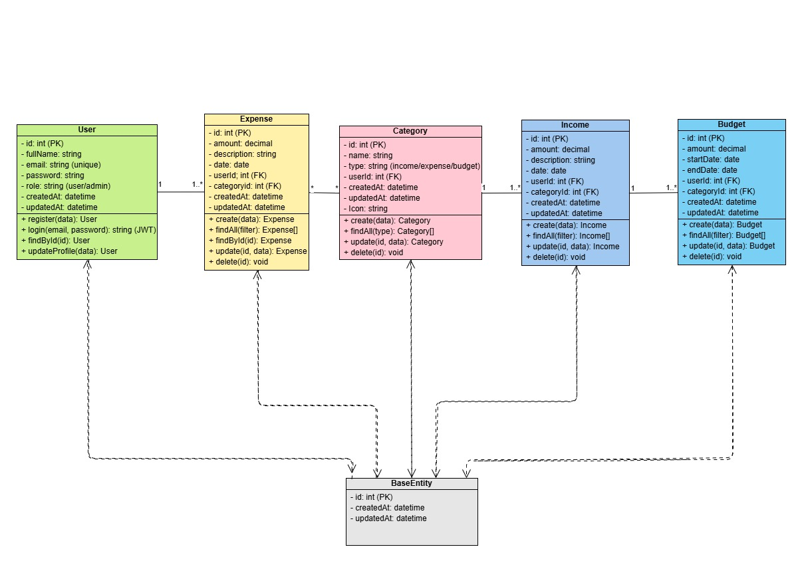
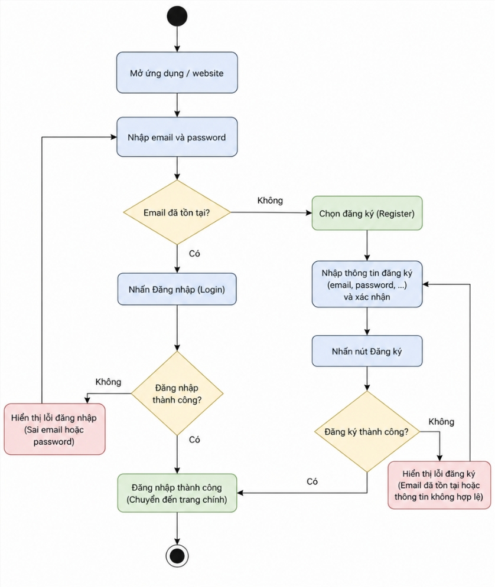
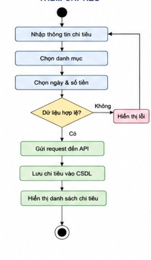
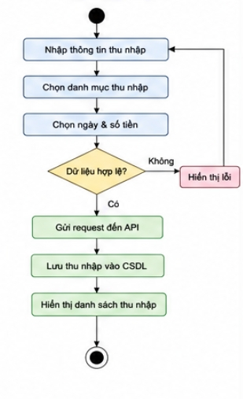
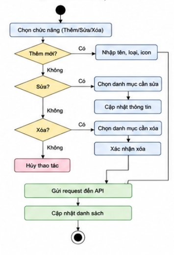
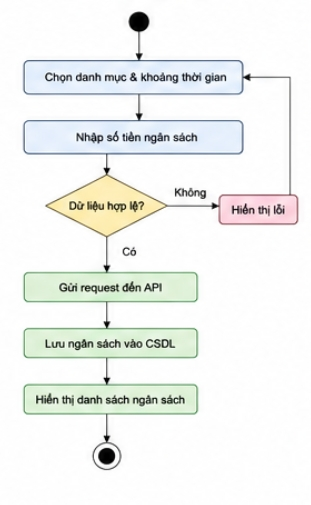
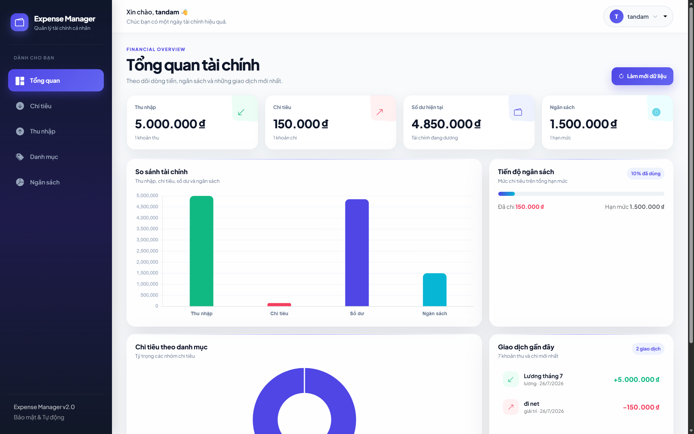

# Ứng dụng quản lý chi tiêu cá nhân 
> **Dự án cuối kỳ môn Lập Trình Web nâng cao**  
> Nhóm I'm back – K18 – Năm học 2026  
> Giảng viên hướng dẫn: TS. Nguyễn Lệ Thu


Dự án **Ứng dụng quản lý chi tiêu cá nhân** được phát triển theo mô hình Client – Server, là bài tập lớn cho môn học Lập trình Web. Ứng dụng cung cấp các chức năng cơ bản để quản lý chi tiêu cá nhân.

--- 
## 🎯 Giới thiệu

Mục tiêu của dự án là xây dựng một ứng dụng phần mềm hoàn chỉnh, áp dụng các nguyên tắc của lập trình

Hệ thống được thiết kế để giải quyết các bài toán cơ bản trong việc quản lý chi tiêu cá nhân, bao gồm quản lý thu nhập, chi tiêu, và theo dõi chi tiêu. Với giao diện web đơn giản và thân thiện, ứng dụng phù hợp cho mục đích học tập và có thể dễ dàng mở rộng, phát triển thêm các tính năng nâng cao trong tương lai.

--- 
## 📖 Mục lục

- [Ứng dụng quản lý chi tiêu cá nhân](#-ứng-dụng-quản-lý-chi-tiêu-cá-nhân)
  - [🎯 Giới thiệu](#-giới-thiệu)
  - [📖 Mục lục](#-mục-lục)
  - [👥 Thành viên nhóm](#-thành-viên-nhóm)
  - [🏗️ Phân tích và Thiết kế](#️-phân-tích-và-thiết-kế)
  - [📂 Cấu trúc Thư mục](#-cấu-trúc-thư-mục)
  - [✨ Tính năng chính](#-tính-năng-chính)
  - [📊 Biểu đồ lớp (Class Diagram)](#-biểu-đồ-lớp-class-diagram)
  - [🔁 Biểu đồ hoạt động (Activity Diagram)](#-biểu-đồ-hoạt-động-activity-diagram)
  - [🖼️ Giao diện chương trình (Console)](#️-giao-diện-chương-trình-console)
  - [💡 Công nghệ sử dụng](#-công-nghệ-sử-dụng)
  - [📚 Tài liệu tham khảo](#-tài-liệu-tham-khảo)


--- 

## 👥 Thành viên nhóm

| STT | Họ tên           | Mã sinh viên | GitHub                                             | Vai trò        |
|-----|------------------|-------------|----------------------------------------------------|----------------|
| 1   | Nguyễn Xuân Thắng| 24100529    | [nthagg03](https://github.com/nthagg03)           | Team Leader    |
| 2   | Đàm Thế Tân    | 24100270 | [TanDam06](https://github.com/TanDam06)           | Developer      |

--- 

## 🏗️ Phân tích và Thiết kế

Hệ thống quản lý chi tiêu cá nhân được xây dựng theo mô hình hướng đối tượng (Object-Oriented Programming), gồm 05 đối tượng chính: **User**, **Expense**, **Income**, **Category** và **Budget**. Các đối tượng có mối quan hệ với nhau thông qua khóa ngoại và được ánh xạ với cơ sở dữ liệu bằng TypeORM.

---

<details>
<summary><strong>👤 User (Người dùng)</strong></summary>

### Thuộc tính

| Thuộc tính | Kiểu dữ liệu | Mô tả |
|------------|--------------|------|
| id | number | Mã người dùng |
| username | string | Tên đăng nhập |
| email | string | Địa chỉ email |
| password | string | Mật khẩu đã mã hóa |
| createdAt | Date | Ngày tạo tài khoản |
| updatedAt | Date | Ngày cập nhật |

### Phương thức

- `register()` : Đăng ký tài khoản mới.
- `login()` : Đăng nhập hệ thống.
- `logout()` : Đăng xuất tài khoản.
- `findAll()` : Lấy danh sách người dùng.
- `findOne(id)` : Lấy thông tin người dùng theo ID.
- `update(id)` : Cập nhật thông tin người dùng.
- `remove(id)` : Xóa người dùng.
- `hashPassword()` : Mã hóa mật khẩu bằng bcrypt.
- `validateUser()` : Kiểm tra thông tin đăng nhập.

### Quan hệ

- Một User có nhiều Expense.
- Một User có nhiều Income.
- Một User có nhiều Budget.
- Một User có nhiều Category.

</details>

---

<details>
<summary><strong>💸 Expense (Chi tiêu)</strong></summary>

### Thuộc tính

| Thuộc tính | Kiểu dữ liệu | Mô tả |
|------------|--------------|------|
| id | number | Mã chi tiêu |
| description | string | Nội dung chi tiêu |
| amount | decimal | Số tiền chi tiêu |
| expenseDate | Date | Ngày phát sinh |
| categoryId | number | Danh mục |
| userId | number | Người tạo |

### Phương thức

- `createExpense()` : Thêm khoản chi mới.
- `findAllExpenses()` : Lấy toàn bộ khoản chi.
- `findExpenseById(id)` : Tìm khoản chi theo ID.
- `updateExpense(id)` : Cập nhật khoản chi.
- `deleteExpense(id)` : Xóa khoản chi.
- `getExpenseByCategory()` : Lọc theo danh mục.
- `getExpenseByDate()` : Lọc theo ngày.
- `calculateTotalExpense()` : Tính tổng chi tiêu.

### Quan hệ

- Expense thuộc một User.
- Expense thuộc một Category.

</details>

---

<details>
<summary><strong>💰 Income (Thu nhập)</strong></summary>

### Thuộc tính

| Thuộc tính | Kiểu dữ liệu | Mô tả |
|------------|--------------|------|
| id | number | Mã thu nhập |
| description | string | Nội dung thu nhập |
| amount | decimal | Số tiền thu |
| incomeDate | Date | Ngày phát sinh |
| categoryId | number | Danh mục |
| userId | number | Người tạo |

### Phương thức

- `createIncome()` : Thêm khoản thu.
- `findAllIncomes()` : Lấy danh sách thu nhập.
- `findIncomeById(id)` : Tìm thu nhập theo ID.
- `updateIncome(id)` : Cập nhật thu nhập.
- `deleteIncome(id)` : Xóa thu nhập.
- `getIncomeByCategory()` : Lọc theo danh mục.
- `getIncomeByDate()` : Lọc theo ngày.
- `calculateTotalIncome()` : Tính tổng thu nhập.

### Quan hệ

- Income thuộc một User.
- Income thuộc một Category.

</details>

---

<details>
<summary><strong>📂 Category (Danh mục)</strong></summary>

### Thuộc tính

| Thuộc tính | Kiểu dữ liệu | Mô tả |
|------------|--------------|------|
| id | number | Mã danh mục |
| name | string | Tên danh mục |
| description | string | Mô tả |
| userId | number | Chủ sở hữu |

### Phương thức

- `createCategory()` : Thêm danh mục.
- `findAllCategories()` : Lấy danh sách danh mục.
- `findCategoryById(id)` : Lấy danh mục theo ID.
- `updateCategory(id)` : Cập nhật danh mục.
- `deleteCategory(id)` : Xóa danh mục.

### Quan hệ

- Một Category có nhiều Expense.
- Một Category có nhiều Income.
- Một Category có nhiều Budget.
- Category thuộc một User.

</details>

---

<details>
<summary><strong>📈 Budget (Ngân sách)</strong></summary>

### Thuộc tính

| Thuộc tính | Kiểu dữ liệu | Mô tả |
|------------|--------------|------|
| id | number | Mã ngân sách |
| amount | decimal | Số tiền ngân sách |
| startDate | Date | Ngày bắt đầu |
| endDate | Date | Ngày kết thúc |
| categoryId | number | Danh mục áp dụng |
| userId | number | Người tạo |

### Phương thức

- `createBudget()` : Tạo ngân sách.
- `findAllBudgets()` : Lấy danh sách ngân sách.
- `findBudgetById(id)` : Lấy ngân sách theo ID.
- `updateBudget(id)` : Cập nhật ngân sách.
- `deleteBudget(id)` : Xóa ngân sách.
- `calculateRemainingBudget()` : Tính ngân sách còn lại.
- `calculateSpentBudget()` : Tính số tiền đã sử dụng.
- `checkBudgetStatus()` : Kiểm tra trạng thái ngân sách.

### Quan hệ

- Budget thuộc một User.
- Budget thuộc một Category.

</details>

--- 

## 📂 Cấu trúc Thư mục

```plaintext
Quanlychitieu/
 ├─ backend/
 │   ├─ src/
 │   │   ├─ auth/
 │   │   ├─ expenses/
 │   │   ├─ categories/
 │   │   ├─ database/
 │   │   ├─ incomes/
 │   │   ├─ budgets/
 │   │   ├─ users/
 │   │   ├─ main.ts
 │   │   ├─ app.module.ts
 │   │   ├─ app.controller.ts
 │   │   ├─ app.service.ts
 │   │   ├─ ...
 │   ├─ test/
 │   ├─ .env
 │   ├─ ...
 ├─ frontend/
 │   ├─ src/
 │   │   ├─ api/
 │   │   │   ├─ axiosClient.js                                                 # Cấu hình Axios để kết nối Frontend với Backend.
 │   │   ├─ components/
 │   │   │   ├─ AppLayout.css
 │   │   │   ├─ AppLayout.js
 │   │   │   ├─ ProtectedRoute.js
 │   │   │   ├─ Sidebar.js
 │   │   │   ├─ Topbar.js
 │   │   ├─ pages/
 │   │   │   ├─ Budgets.js
 │   │   │   ├─ Categories.js
 │   │   │   ├─ Dashboard.js
 │   │   │   ├─ Expenses.js
 │   │   │   ├─ Incomes.js
 │   │   │   ├─ Login.js
 │   │   │   ├─ Register.js
 │   │   ├─ utils/
 │   │   │   ├─ auth.js
 │   │   │   ├─ formatCurrency.js
 │   │   ├─ App.css
 │   │   ├─ App.js
 │   │   ├─ index.css
 │   │   ├─ ...
 ├─ Img/                                                                        # chứa UML, activity diagram,...
README.md                                                                       # Tài liệu mô tả dự án 
```

--- 
## ✨ Tính năng chính

>Hệ thống Quản lý Chi tiêu Cá nhân được phát triển nhằm hỗ trợ người dùng quản lý tài chính cá nhân một cách hiệu quả, trực quan và an toàn. Ứng dụng cung cấp các chức năng chính sau

### 🔐 **Quản lý tài khoản người dùng**
- **Đăng ký tài khoản mới bằng tên đăng nhập, email và mật khẩu.**
- **Đăng nhập bằng JWT Authentication.**
- **Mã hóa mật khẩu bằng bcrypt trước khi lưu vào cơ sở dữ liệu.**
- **Đăng xuất và bảo vệ các API yêu cầu xác thực.**
### 💸 **Quản lý khoản chi (Expenses)**
- **Thêm khoản chi mới.**
- **Chỉnh sửa thông tin khoản chi.**
- **Xóa khoản chi.**
- **Hiển thị danh sách toàn bộ khoản chi.**
- **Tìm kiếm và lọc khoản chi theo danh mục hoặc thời gian.**
- **Thống kê tổng số tiền đã chi.**
### 💰 **Quản lý khoản thu (Incomes)**
- **Thêm khoản thu nhập mới.**
- **Cập nhật thông tin khoản thu.**
- **Xóa khoản thu.**
- **Hiển thị danh sách thu nhập.**
- **Lọc dữ liệu theo danh mục hoặc ngày phát sinh.**
- **Thống kê tổng thu nhập.**
### 📂 **Quản lý danh mục (Categories)**
- **Tạo danh mục mới.**
- **Chỉnh sửa danh mục.**
- **Xóa danh mục.**
- **Hiển thị danh sách danh mục.**
- **Liên kết danh mục với các khoản thu, khoản chi và ngân sách.**
### 📈 **Quản lý ngân sách (Budgets)**
- **Thiết lập ngân sách cho từng danh mục.**
- **Cập nhật hoặc xóa ngân sách.**
- **Theo dõi số tiền đã sử dụng.**
- **Hiển thị số tiền còn lại của từng ngân sách.**
- **Cảnh báo khi ngân sách vượt giới hạn đã thiết lập.** 
### 📊 **Dashboard thống kê**
- **Hiển thị tổng thu nhập.**
- **Hiển thị tổng chi tiêu.**
- **Hiển thị số dư hiện tại.**
- **Biểu đồ trực quan về tình hình tài chính.**
- **Thống kê nhanh giúp người dùng dễ dàng theo dõi dòng tiền.**
### 🔒 **Bảo mật hệ thống**
- **Xác thực bằng JWT (JSON Web Token).**
- **Mã hóa mật khẩu bằng bcrypt.**
- **Kiểm tra dữ liệu đầu vào bằng Validation.**
- **Phân quyền người dùng theo tài khoản.**
- **Chỉ chủ sở hữu mới có quyền truy cập và chỉnh sửa dữ liệu của mình.**
### 💻 **Giao diện người dùng**
- **Giao diện hiện đại, thân thiện và dễ sử dụng.**
- **Thiết kế Responsive phù hợp trên nhiều kích thước màn hình.**
- **Các chức năng được bố trí khoa học giúp người dùng thao tác thuận tiện.**
--- 

## 📊 Biểu đồ lớp (Class Diagram)



--- 

## 🔁 Biểu đồ hoạt động (Activity Diagram)

### 1. Đăng nhập



### 2. Chi tiêu



### 3. Thu nhập



### 4. Quản lý danh mục



### 5. Quản lý ngân sách



--- 

## 🖼️ Giao diện chương trình (Console)




--- 

## 💡 Công nghệ sử dụng

| Thành phần | Công nghệ |
|------------|-----------|
| Frontend | ReactJS, React Router DOM, Axios, Bootstrap 5, Chart.js |
| Backend | NestJS, TypeScript, JWT, bcrypt, TypeORM |
| Database | MySQL |
| Kiểm thử | Postman |
| Quản lý mã nguồn | Git, GitHub |
| IDE | Visual Studio Code |
--- 

## 📚 Tài liệu tham khảo

- Slide học phần Lập trình Web Nâng cao Đại học Phenikaa. – GVHD: Nguyễn Lệ Thu
- NestJS, React Documentation
- Stack Overflow – Community

--- 

# Installation

## Clone repository

```bash
git clone https://github.com/your-group/ExpenseManagement.git
```

---

## Backend

```bash
cd backend

npm install
```

Create `.env`

```env
PORT=3001
DB_HOST=expense-management-db-emdb.c.aivencloud.com
DB_USER=avnadmin
DB_NAME=defaultdb
DB_PORT=14390
DB_PASSWORD=your_password
DB_DATABASE=expense_management
JWT_SECRET=your_secret_key
```

Run backend

```bash
npm run start:dev
```

---

## Frontend

```bash
cd frontend

npm install

npm start
```

Frontend

```
http://localhost:3000
```

Backend

```
http://localhost:3001
```


> © 2026 Nhóm I'm back    
> *Ứng dụng quản lý chi tiêu – Mã nguồn mở cho mục đích học tập*
